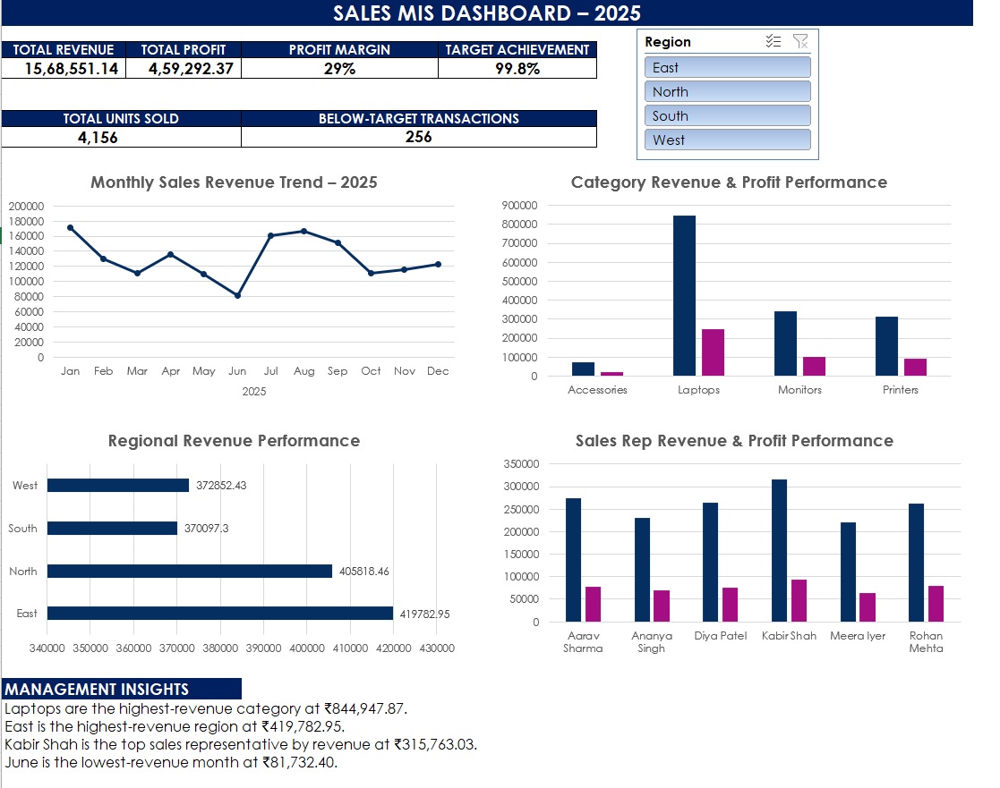
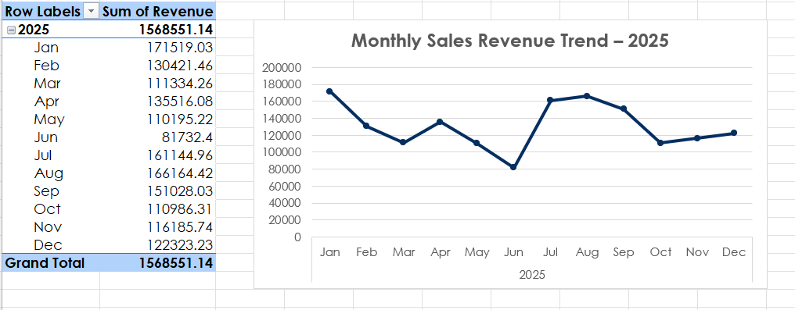
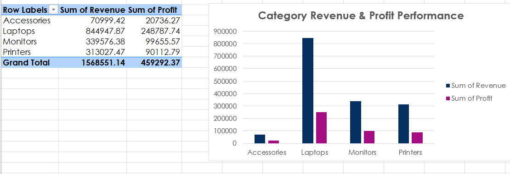
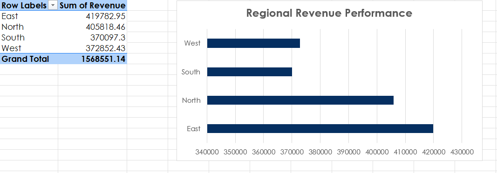
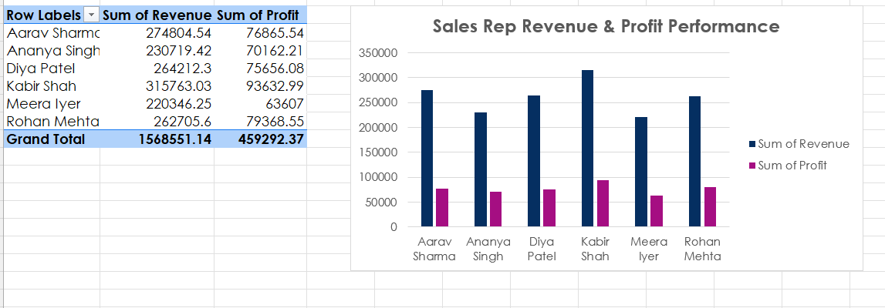
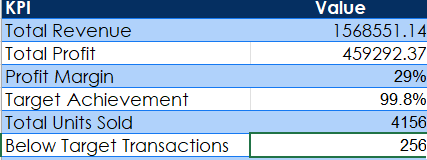

# sales-mis-dashboard
Excel-based Sales MIS dashboard analyzing revenue, profit, targets, trends, regional performance, and sales rep performance.

## 📊 Project Overview

This project is an Excel-based **Sales MIS Reporting and Dashboard solution** designed to analyze sales performance across multiple business dimensions.

The project uses **500 sales transactions from 2025** and provides management-level insights into revenue, profit, target achievement, product/category performance, regional performance, sales representative performance, and monthly sales trends.

The final solution combines structured Excel data, lookup formulas, KPI reporting, PivotTables, PivotCharts, interactive slicers, and management insights into a professional MIS dashboard.

---

## 🎯 Business Objective

The objective of this project is to transform raw sales transaction data into a structured reporting solution that helps management:

- Track total revenue and profit
- Monitor profit margin
- Measure target achievement
- Analyze monthly sales trends
- Identify high-performing product categories
- Compare regional sales performance
- Evaluate sales representative performance
- Identify below-target transactions
- Support data-driven business decisions

---

## 🛠️ Tools & Excel Skills Used

- Microsoft Excel
- Excel Tables
- PivotTables
- PivotCharts
- Slicers
- Lookup formulas
- SUM
- SUMIFS
- COUNTIF / COUNTIFS
- IF / IFERROR
- Data Validation
- Calculated Columns
- Conditional Analysis
- KPI Reporting
- Dashboard Design
- Management Insights

---

## 📁 Workbook Structure

The Excel workbook contains the following analysis sheets:

| Sheet | Purpose |
|---|---|
| `Sales_Data` | Raw sales transaction data and calculated fields |
| `Lookup_Lists` | Product, category, standard price and target lookup information |
| `KPI_Report` | Key management KPIs |
| `Trend_Analysis` | Monthly sales revenue trend |
| `Category_Analysis` | Revenue and profit performance by category |
| `Region_Analysis` | Revenue performance by region |
| `SalesRep_Analysis` | Revenue and profit performance by sales representative |
| `Pivot_Analysis` | Supporting PivotTable analysis |
| `Dashboard` | Interactive management dashboard |

---

## 📈 Key KPIs

The dashboard reports the following key performance indicators:

| KPI | Result |
|---|---:|
| Total Revenue | ₹1,568,551.14 |
| Total Profit | ₹459,292.37 |
| Profit Margin | 29.27% |
| Target Achievement | 99.8% |
| Total Units Sold | 4,156 |
| Below-Target Transactions | 256 |

---

## 📊 Dashboard

The interactive dashboard provides a consolidated view of sales performance through KPI cards, charts, a Region slicer, and management insights.

### Dashboard Preview

---

## 📅 Monthly Sales Revenue Trend

The monthly trend analysis tracks revenue performance throughout 2025.

### Trend Analysis

### Key Observation

- **June recorded the lowest monthly revenue at ₹81,732.40.**
- Sales recovered strongly in July and August.
- January recorded the highest monthly revenue at ₹171,519.03.

---

## 🏷️ Category Performance

Category analysis compares revenue and profit across the major product categories.

### Category Analysis

### Key Observation

**Laptops** generated the highest revenue at **₹844,947.87**, making them the strongest-performing category in the dataset.

---

## 🌎 Regional Performance

Regional analysis compares sales revenue across the four operating regions.

### Region Analysis

### Key Observation

**East** recorded the highest regional revenue at **₹419,782.95**.

---

## 👤 Sales Representative Performance

Sales representative analysis compares revenue and profit contribution across the sales team.

### Sales Representative Analysis

### Key Observation

**Kabir Shah** was the top-performing sales representative by revenue, generating **₹315,763.03**.

---

## 📋 KPI Report

The KPI report provides a concise management-level summary of the overall sales performance.

---

## 💡 Management Insights

The analysis generated the following key business insights:

1. **Laptops are the highest-revenue category**, contributing ₹844,947.87 in revenue.
2. **East is the highest-performing region**, generating ₹419,782.95 in revenue.
3. **Kabir Shah is the top sales representative by revenue**, with ₹315,763.03.
4. **June is the weakest sales month**, with revenue of ₹81,732.40.
5. Overall **target achievement is 99.8%**, indicating that actual revenue was very close to the overall target.
6. The dashboard identifies **256 below-target transactions**, providing an opportunity for management to investigate underperforming sales.

---

## 🔎 Interactive Dashboard Features

The dashboard includes:

- KPI cards for quick performance monitoring
- Monthly revenue trend visualization
- Category revenue and profit comparison
- Regional revenue comparison
- Sales representative performance analysis
- Interactive **Region slicer**
- Management insights section
- PivotTable and PivotChart-based reporting

The Region slicer allows users to filter the connected dashboard analysis and dynamically review performance by region.

---

## 📂 How to Use

1. Download the Excel workbook from this repository.
2. Open `Sales_MIS_Project_Excel.xlsx` in Microsoft Excel.
3. Navigate to the `Dashboard` sheet.
4. Use the **Region slicer** to interact with the dashboard.
5. Review the supporting analysis sheets for detailed performance information.

---

## 💼 Skills Demonstrated

This project demonstrates practical experience in:

**Data Preparation → Lookup & Calculated Fields → KPI Reporting → PivotTable Analysis → Dashboard Development → Interactive Reporting → Business Insights**

The project focuses on converting transactional sales data into a structured **MIS reporting solution for management decision-making**.

---

## 👨‍💻 Project Type

**Sales Trend Analysis & MIS Reporting Dashboard**

**Author** Shalu Kumari
**Tool:** Microsoft Excel  
**Dataset:** 500 sales transactions  
**Period:** 2025  
**Focus:** Sales Performance, Profitability, Targets & Management Reporting
